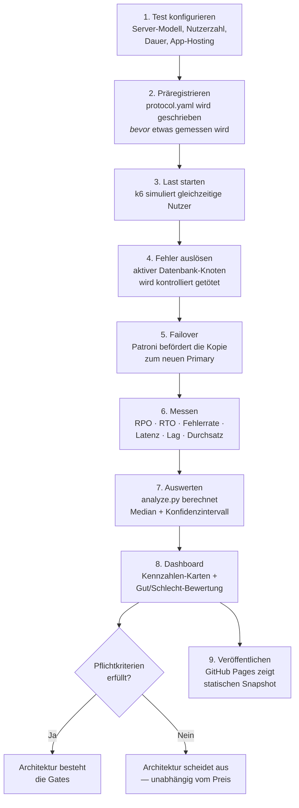

# Hybrid Database Decision Lab — Gesamtdokumentation

In diesen Doku werden Fachbegriffe bei ihrer ersten Verwendung kurz erklärt. Ziel ist, dass auch Leser ohne tiefes Datenbank-Fachwissen nachvollziehen können, was hier gemessen wird, wie und warum.

## Ablauf auf einen Blick



---

## 1. Worum geht es in diesem Projekt?

Unternehmen müssen oft entscheiden, wo ihre Datenbank und ihre Anwendung laufen sollen: im eigenen Rechenzentrum ("On-Premises", kurz **On-Prem**), in der Cloud, oder in einer Mischform ("Hybrid"). Diese Entscheidung wird in der Praxis häufig aus Bauchgefühl oder Marketingversprechen getroffen — nicht auf Basis von Messungen.

Dieses Projekt ist ein **Proof of Concept (PoC)**, zu Deutsch ein "Konzeptnachweis": ein funktionierendes Testlabor, das zeigt, wie man eine solche Entscheidung stattdessen **wissenschaftlich fundiert** treffen kann — mit echten Messungen statt Annahmen.

Die zentrale Frage, die das Projekt beantworten will, lautet **nicht**:

> "Welche Architektur ist allgemein die beste?"

sondern:

> "Erfüllt Architektur X unter einem festgelegten Test die Mindestanforderungen — und wie schneidet sie im Vergleich zu Architektur Y ab?"

Das ist ein wichtiger Unterschied: Das Projekt behauptet nicht, dass Hybrid, Cloud oder On-Prem grundsätzlich überlegen ist. Es liefert die **Methode und das Werkzeug**, um diese Frage für eine konkrete Situation zu beantworten.

---

## 2. Der wissenschaftliche Ansatz

### 2.1 Warum "wissenschaftlich"?

Eine Messung ist nur dann glaubwürdig, wenn sie bestimmten Regeln folgt. Dieses Projekt übernimmt vier Prinzipien aus der experimentellen Forschung:

1. **Präregistrierung**: Bevor ein Test läuft, wird schriftlich festgehalten, was gemessen wird, unter welchen Bedingungen und welches Ergebnis als "erfolgreich" gilt. Das verhindert, dass man nachträglich die Kriterien passend zum Ergebnis biegt. Diese Datei heißt `protocol.yaml`.
2. **Wiederholung**: Ein einzelner Testlauf ist Zufall. Erst mehrere Wiederholungen zeigen, ob ein Ergebnis stabil ist. Deshalb rechnet das Projekt mit Median-Werten (dem mittleren Wert einer Reihe von Messungen) und Konfidenzintervallen (einer Spanne, in der der "wahre" Wert mit hoher Wahrscheinlichkeit liegt).
3. **Herkunfts-Kennzeichnung (Provenienz)**: Jede Zahl im Projekt trägt ein Etikett, das sagt, woher sie stammt:
   - **MEASURED** — aus einem echten, tatsächlich durchgeführten Testlauf.
   - **SIMULATED** — aus einer Demonstration oder einem Testdatensatz, keine echte Messung.
   - **MODELLED** — aus einer Berechnung mit angenommenen Werten (z. B. das Kostenmodell).
   - **ASSESSED** — eine begründete Experten-Einschätzung, kein Messwert (z. B. "Datenhoheit").
   Diese Kategorien werden **niemals vermischt**. Eine simulierte Demo-Zahl fließt nie in die echten Kennzahlen ein.
4. **Getrennte Rohdaten**: Die unbearbeiteten Messergebnisse jedes Tests werden zusammen mit einer Prüfsumme (SHA-256-Hash, eine Art digitaler Fingerabdruck der Datei) gespeichert und nachträglich nicht mehr verändert. So bleibt nachvollziehbar, was tatsächlich gemessen wurde.

### 2.2 Die Pflichtkriterien ("Gates")

Bevor überhaupt verglichen wird, muss eine Architektur zwei Mindestanforderungen erfüllen:

- **RTO ≤ 30 Sekunden** (Recovery Time Objective — wie lange darf der Dienst nach einem Ausfall höchstens gebraucht haben, um wieder zu funktionieren)
- **0 verlorene bestätigte Schreibvorgänge** (RPO — Recovery Point Objective, siehe Abschnitt 4)

Eine Architektur, die diese Gates nicht besteht, scheidet aus — unabhängig davon, wie gut sie sonst abschneidet. Das verhindert, dass ein niedriger Preis eine inakzeptable Ausfallsicherheit "wettmacht".

---

## 3. Die drei Betriebsmodi

Das Projekt bildet drei mögliche Architekturen ab:

| Modus | Bedeutung |
|---|---|
| **ON_PREM_ONLY** | Anwendung und Datenbank laufen beide im eigenen Rechenzentrum. |
| **CLOUD_ONLY** | Anwendung und Datenbank laufen beide in der Cloud. |
| **HYBRID** | Ein Standort ist aktiv ("Primary"), der andere hält eine laufend synchronisierte Kopie ("Standby"). Bei einem Ausfall übernimmt der Standby-Standort. |

### 3.1 Die bewusste Architektur-Entscheidung dieses Labs

Zusätzlich bildet das Projekt eine spezielle, in der Praxis sehr verbreitete Variante von Hybrid ab: **die Datenbank bleibt immer On-Prem, die Anwendung (der "App-Layer") wird auf einer oder mehreren Clouds gehostet.**

Der Grund: Datenbanken enthalten oft sensible oder regulierte Daten (Datenhoheit, Compliance), während die Anwendung selbst zustandslos ist und sich leicht auf mehrere Cloud-Anbieter verteilen lässt ("Multi-Cloud", z. B. gleichzeitig AWS und Azure). Diese Trennung wird im Testlabor exakt nachgebildet: die Postgres-Datenbank läuft fest lokal, während die synthetische "Demo-API" (siehe Abschnitt 5) stellvertretend für den frei platzierbaren App-Layer steht.

---

## 4. Die sechs gemessenen Kennzahlen (nach Priorität)

Das Projekt misst sechs Kennzahlen, in genau dieser Reihenfolge, weil ein Datenverlust schwerer wiegt als eine langsame Antwortzeit:

1. **RPO — Datenverlust.** Wie viele bereits bestätigte Schreibvorgänge gehen bei einem Ausfall verloren? Das härteste Ausschlusskriterium, weil verlorene Daten sich nicht nachträglich reparieren lassen. Gemessen über kontinuierliche "Proben" (kleine Testschreibvorgänge alle 0,2 Sekunden), die vor und nach dem Ausfall verglichen werden.
2. **RTO — Ausfallzeit.** Wie lange dauert es, bis der Dienst nach einem Ausfall wieder Schreibzugriffe akzeptiert?
3. **Fehlerrate.** Welcher Anteil der Nutzeranfragen schlägt während des Tests fehl? Zeigt, ob Nutzer den Ausfall überhaupt bemerken.
4. **Latenz (p95/p99).** Wie schnell antwortet das System unter Last? "p95" bedeutet: 95 % aller Anfragen sind schneller als dieser Wert — das ist aussagekräftiger als ein Durchschnittswert, weil einzelne sehr langsame Ausreißer den Durchschnitt verzerren, aber im p95/p99-Wert trotzdem sichtbar bleiben.
5. **Replication Lag.** Wie weit hinkt die Kopie der Datenbank dem Original hinterher? Ein früher Warnindikator: steigt dieser Wert an, wächst das Risiko für Punkt 1 (Datenverlust).
6. **Durchsatz und Kosten.** Wie viele Anfragen pro Sekunde schafft das System, und was kostet der Betrieb pro Monat?

---

## 5. Die technische Umgebung

Das Testlabor besteht aus mehreren Bausteinen, die alle als Docker-Container laufen (Docker: eine Technik, um Software in isolierten, reproduzierbaren Umgebungen zu betreiben):

- **PostgreSQL + Patroni** (zwei Datenbank-Knoten): Patroni überwacht die Datenbank und führt bei einem Ausfall automatisch einen "Failover" durch — die Kopie wird zur neuen Hauptdatenbank befördert.
- **HAProxy**: leitet Anfragen immer zur aktuell aktiven Datenbank weiter, auch nach einem Failover.
- **etcd**: eine kleine Koordinationsdatenbank, die Patroni nutzt, um sich zwischen den Knoten abzustimmen (wer ist gerade "Primary").
- **Demo API**: eine eigens gebaute, einfache Beispiel-Anwendung ("synthetischer Beispiel-Dienst"), die stellvertretend für eine echte Web-Anwendung Anfragen an die Datenbank schickt — das ist die Last, unter der getestet wird.
- **k6**: ein Lasttest-Werkzeug, das viele gleichzeitige Nutzer simuliert.
- **Prometheus, Grafana, Loki**: Überwachungswerkzeuge. Prometheus sammelt Messwerte, Grafana stellt sie grafisch dar, Loki sammelt Log-Dateien.
- **dashboard**: ein eigens gebauter Dienst, der die Ergebnisse aufbereitet und über eine Weboberfläche zugänglich macht (siehe Abschnitt 6).

---

## 6. Das Dashboard

Unter `http://localhost:8000` (lokal) bzw. der veröffentlichten GitHub-Pages-Adresse (öffentlich, siehe Abschnitt 9) zeigt eine Weboberfläche alle Ergebnisse:

- **Kennzahlen-Karten**: die sechs Werte aus Abschnitt 4, mit einer Ampel-Markierung (PASS/FAIL/NO DATA), ob die Pflichtkriterien erfüllt sind. Aktualisiert sich automatisch alle 5 Sekunden.
- **Live-Panel**: erscheint automatisch, sobald ein Test gerade läuft, und zeigt in Echtzeit, was gerade passiert (z. B. "Primary getötet" → "Neuer Primary erkannt" → "Test abgeschlossen").
- **Letzte Runs**: eine Tabelle mit jedem einzelnen Testergebnis, inklusive einer Gut/Achtung/Schlecht-Bewertung (berechnet gegen die Pflichtkriterien) und einer Klartext-Beschreibung des Szenarios (z. B. welcher Server-Typ, wie viele gleichzeitige Nutzer, welche Cloud für den App-Layer angenommen wurde).

---

## 7. Wie ein Test abläuft

1. **Präregistrieren**: `python scripts/new_experiment.py` legt die Testbedingungen fest (Szenario, Server-Größe, Nutzerzahl, Testdauer, App-Hosting) und schreibt sie in `protocol.yaml`, bevor irgendetwas gemessen wird.
2. **Ausführen**: `python scripts/run_failover.py` startet den eigentlichen Test:
   - Erkennt, welcher Datenbank-Knoten gerade aktiv ist.
   - Startet die simulierte Nutzerlast (k6).
   - Nach einer Aufwärmphase: tötet gezielt den aktiven Datenbank-Knoten (kontrollierter Fehlerfall).
   - Misst, wie lange es dauert, bis ein neuer Knoten übernimmt und der Dienst wieder funktioniert.
   - Vergleicht die zuletzt bestätigten Schreibvorgänge vor und nach dem Ausfall, um Datenverlust zu erkennen.
   - Speichert alle Rohdaten mit Prüfsumme.
3. **Auswerten**: `python analysis/analyze.py` berechnet aus allen bisherigen Testläufen Median, Minimum, Maximum und ein Bootstrap-Konfidenzintervall (eine Methode, um trotz weniger Wiederholungen eine statistisch fundierte Unsicherheitsspanne zu berechnen) und schreibt das Ergebnis in eine Datei, die das Dashboard automatisch anzeigt.

Diese drei Schritte lassen sich auch direkt über das Dashboard konfigurieren und starten (Abschnitt 8).

---

## 8. Szenario-Konfiguration über das Dashboard

Im Bereich **"Szenario & Last einstellen"** lässt sich ein Test ohne Kommandozeile konfigurieren:

- **On-Prem Server-Modell** (Klein/Mittel/Groß): setzt echte CPU- und Arbeitsspeicher-Grenzen für die Datenbank-Container (z. B. "Klein" = 1 Prozessorkern / 1 GB RAM). Das beeinflusst die gemessene Leistung tatsächlich, nicht nur kosmetisch.
- **Gleichzeitige Nutzer**: legt fest, wie viele simulierte Nutzer parallel auf die Anwendung zugreifen.
- **Testdauer**: 1 bis 10 Minuten.
- **App-Hosting (Cloud/Multi-Cloud)**: ein dokumentiertes Szenario-Label (AWS/Azure/GCP/OCI, einzeln oder kombiniert), das festhält, wo der App-Layer laut Szenario laufen würde. Es handelt sich um eine **Beschriftung**, keine echte Cloud-Bereitstellung — das Projekt hat keine echten Cloud-Konten angebunden.

Der Button **"▶ Jetzt ausführen"** startet den Test direkt aus dem Browser. Technisch passiert dabei Folgendes: Das Dashboard hat Zugriff auf den Docker-Verwaltungskanal des Rechners (den "Docker-Socket") und kann dadurch selbst die Testskripte starten und die Server-Grenzen setzen. Das ist eine bewusste, folgenreiche Entscheidung — der Dashboard-Dienst bekommt dadurch weitreichende Kontrolle über den Rechner, auf dem er läuft. Deshalb ist der Zugriff durch ein Zugangs-Token geschützt (`DASHBOARD_API_TOKEN` in der `.env`-Datei) und nur auf dem eigenen Rechner erreichbar (`localhost`), nie öffentlich.

---

## 9. Echte Daten aus eigener On-Prem- oder Cloud-Umgebung einspielen

Das Dashboard kann auch mit Messwerten aus einer **echten** Umgebung außerhalb dieses Testlabors gefüttert werden, über zwei Wege:

1. **Datei-Hochladen**: eine JSON-Datei mit den Messwerten im vorgegebenen Format hochladen.
2. **API-Anbindung**: automatisierte Systeme (z. B. eigenes Monitoring) senden die Werte direkt per HTTP-Anfrage.

Für Azure und Oracle Cloud Infrastructure (OCI) lassen sich die nötigen Rohmetriken (Latenz, Fehler, Replication Lag) mit den jeweiligen Kommandozeilen-Werkzeugen exportieren:

```bash
# Azure
az monitor metrics list --resource <resource-id> \
  --metric "replica_lag,active_connections,connections_failed" --output json

# OCI
oci monitoring metric-data summarize-metrics-data \
  --compartment-id <compartment-ocid> --namespace oci_database \
  --query-text 'ReplicationLag[1m].mean()' --output json
```

**Wichtiger Vorbehalt**: RTO und RPO lassen sich nicht aus laufenden Metriken ablesen — dafür ist immer ein echter, kontrollierter Ausfalltest in der jeweiligen Umgebung nötig (so wie es dieses Labor lokal automatisiert tut).

---

## 10. Das Kostenmodell

Die monatlichen Kosten werden aus einer separaten, versionierten Annahmen-Datei (`cost/assumptions.yaml`) berechnet — **nicht** gemessen, sondern modelliert (Kategorie MODELLED). Aktuell enthält diese Datei **Beispielwerte** (klar als solche gekennzeichnet), die vor einer echten Entscheidung durch reale, mit dem eigenen Anbieter verhandelte Preise ersetzt werden müssen.

Die Entscheidungs-Gewichtung (`cost/decision_weights.yaml`) legt fest, wie stark Resilienz (25 %), Performance (20 %), Datenintegrität (15 %), Kosten (15 %), Datenhoheit (10 %), Portabilität (10 %) und Betriebsaufwand (5 %) in eine mögliche Gesamtbewertung einfließen würden — diese Gewichte sind ebenfalls Annahmen (Kategorie ASSESSED), die man an die eigene Organisation anpassen muss.

---

## 11. Grenzen des Projekts (bewusst und ehrlich benannt)

Ein Proof of Concept hat Grenzen, die für die Interpretation der Ergebnisse wichtig sind:

- **Simuliertes Netzwerk**: Die "zwei Standorte" laufen beide auf demselben Rechner in Docker-Netzwerken. Das bildet **keine echte, geografisch verteilte Internetverbindung** ab (reale Latenz, Paketverlust, Bandbreitenbegrenzung fehlen).
- **Einzelner Koordinationsknoten**: etcd läuft nur mit einem Knoten. In einer echten Produktionsumgebung bräuchte man mehrere etcd-Knoten für echte Ausfallsicherheit der Koordination selbst.
- **Ein Messfehler wurde während der Entwicklung gefunden und behoben**: Die ursprüngliche Formel für "Replication Lag" maß fälschlich die Zeit seit dem letzten Schreibvorgang statt der tatsächlichen Verzögerung — bei wenig Last wuchs dieser Wert unbegrenzt, obwohl die Kopie vollständig aktuell war. Der erste echte Testlauf im Projekt zeigt deshalb noch diesen fehlerhaften Wert (~2 Stunden statt Sekundenbruchteilen) — bewusst nicht rückwirkend verändert, weil Rohdaten prinzipiell unangetastet bleiben. Alle Tests danach zeigen den korrekten Wert.
- **Kein echtes Multi-Cloud-Deployment**: Die "App-Hosting"-Auswahl (AWS/Azure/GCP/OCI) im Szenario-Konfigurator ist eine Beschriftung für die Dokumentation des Test-Szenarios, keine tatsächliche Bereitstellung auf diesen Plattformen.
- **Kostenwerte sind Platzhalter** bis sie durch echte, verhandelte Preise ersetzt werden.

---

## 12. Wo läuft was — lokal vs. öffentlich

| Funktion | Lokal (`docker compose up`) | Öffentlich (GitHub Pages) |
|---|---|---|
| Kennzahlen-Karten, Runs-Tabelle | ✅ live, alle 5 s aktualisiert | ✅ als statischer Snapshot der im Repository gespeicherten Testläufe |
| Live-Panel während eines Tests | ✅ | ❌ (kein laufender Test online) |
| Datei-Upload / API-Anbindung | ✅ | ❌ (keine Schreib-Funktion auf einer statischen Seite möglich) |
| "Jetzt ausführen"-Button | ✅ | ❌ |
| Grafana, Prometheus, Demo API, Patroni | ✅ eigene Adressen (`localhost:3000` usw.) | ❌ (siehe unten) |

Grafana, Prometheus und die anderen Live-Dienste laufen bewusst **nicht** über GitHub Actions oder GitHub Pages — beide sind für kurzlebige Jobs bzw. statische Dateien gedacht, nicht für dauerhaft laufende Server. Für einen dauerhaft erreichbaren Live-Stack bräuchte es einen eigenen, durchgehend laufenden Server (z. B. einen kleinen Cloud-VM).

---

## 13. Projektstruktur — kurzer Überblick

```text
api/                    synthetische Demo-Service-API (die Test-Anwendung)
analysis/               Statistik- und Kostenberechnung (Python)
cost/                   versionierte Kostenannahmen und Gewichtungen
dashboard/              lokaler Dashboard-Dienst (Weboberfläche + Upload/API/Steuerung)
experiments/            Präregistrierung + Rohdaten jedes Testlaufs
infra/patroni/          PostgreSQL/Patroni-Konfiguration
observability/          Prometheus-, Grafana-, Loki-Konfiguration
scripts/                Testausführung (new_experiment.py, run_failover.py)
site/                   die veröffentlichte Weboberfläche (auch für GitHub Pages)
workload/k6/            die simulierte Nutzerlast
.github/workflows/      automatische Prüfung + GitHub-Pages-Veröffentlichung
```

---

## 14. Kurzglossar

| Begriff | Bedeutung |
|---|---|
| **RTO** | Recovery Time Objective — maximal tolerierte Ausfallzeit |
| **RPO** | Recovery Point Objective — maximal tolerierter Datenverlust |
| **p95 / p99** | 95 % bzw. 99 % aller Anfragen sind schneller als dieser Wert |
| **Failover** | automatischer Wechsel der aktiven Datenbank bei einem Ausfall |
| **Replication Lag** | Verzögerung, mit der eine Kopie der Datenbank dem Original hinterherhinkt |
| **Provenienz** | die Herkunfts-Kennzeichnung eines Werts (gemessen, simuliert, modelliert, bewertet) |
| **Präregistrierung** | das schriftliche Festhalten der Testbedingungen, bevor der Test läuft |
| **Docker-Container** | eine isolierte, reproduzierbare Laufzeitumgebung für Software |
| **Sibling-Container-Muster** | ein Container steuert über den Docker-Socket andere Container auf demselben Rechner |

---

*Diese Dokumentation beschreibt den Stand des Projekts nach Aufbau des Dashboards, der Live-Testverfolgung, der Szenario-Konfiguration und der GitHub-Pages-Veröffentlichung. Für die ursprüngliche, ausführlichere Forschungsdokumentation siehe die nummerierten Kapitel unter `docs/`.*
